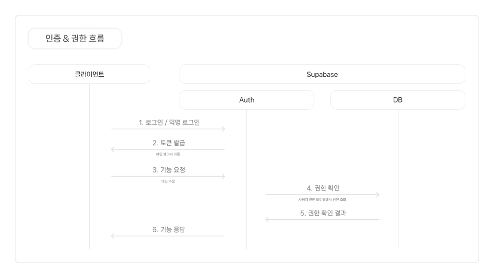
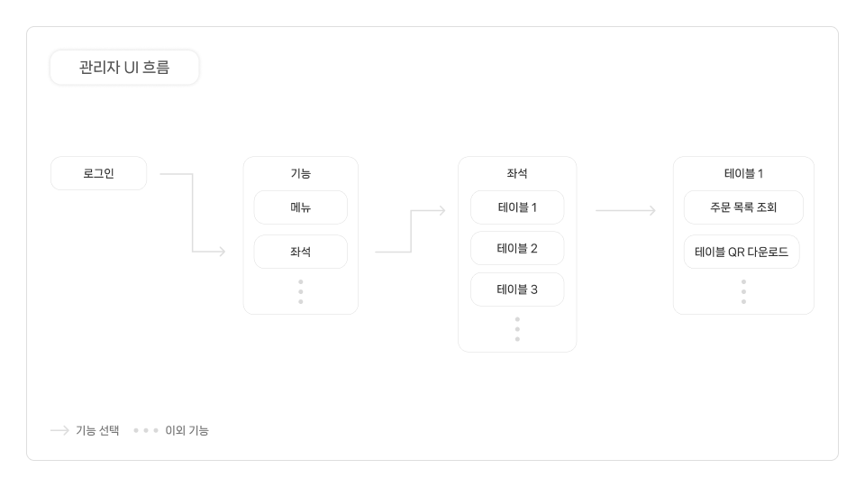
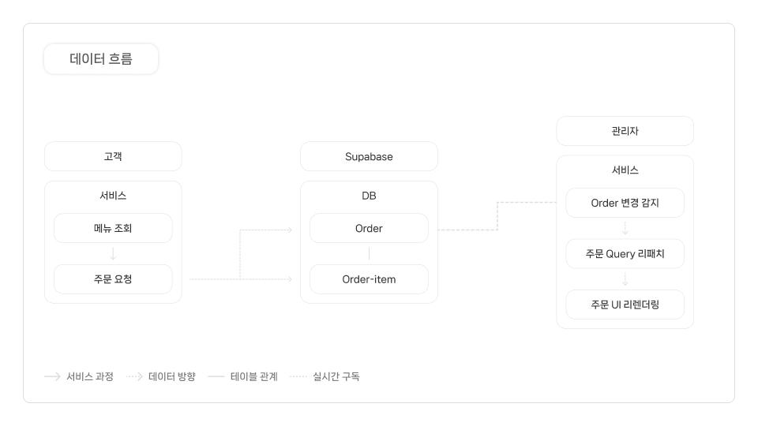

# QR-ORDER-ADMIN

## 프로젝트 소개

### 배경

QR 주문 경험에서 복잡한 UI 문제를 발견하여 단순한 QR 주문 서비스를 개발했습니다. 이후 주문 데이터를 연계하기 위해 **관리자 전용** 서비스를 추가로 구축했습니다. 또한, 향후 **소규모 매장 운영을 위한 실무 테스트** 목적으로도 활용했습니다.

### 지향점

- DB 엔드포인트만 변경하면 **구독 서비스 모델**로 확장 가능하도록 설계
- **유연하고 확장성 있는 관리자 플랫폼 구축** 목표

## 1. 설명

### 1-1. 핵심 기능 요약

- **RLS 적용**: 시제품 체험 시 데이터 권한 보호를 위해 Row-Level Security 적용
- **Motion 애니메이션**: 사용자 경험 향상을 위해 Motion 애니메이션 도입
- **Konva 활용**: 좌석 관리 기능을 Canvas 라이브러리로 구현

### 1-2. 기술 스택

- **Frontend**: React, TypeScript (UI 구성 및 안정성 확보)
- **State Management**: Jotai (단순·가벼운 단위 상태 관리)
- **Backend**: Supabase (인증 · 실시간 · DB 통합 제공)
- **Infra**: Vercel (프론트엔드 배포 자동화)

### 1-3. 시스템 흐름

#### 인증 & 권한



- 권한 역할 분류
  - **guest**: 익명 로그인, 조회만 가능
  - **viewer**: 단순 회원가입, 관리자 허가 이전 조회만 가능
  - **member**: 생성/수정/삭제 가능

#### 관리자 UI 흐름



#### 데이터 흐름



### 1-4. 미리보기

- **로그인 및 권한 확인 (인증 흐름)**  
  캡챠 인증 → 익명 로그인 → 메뉴 선택

  

- **좌석 선택과 주문 확인 (관리자 UI 흐름)**  
  주문 탭 → 테이블 선택 → 모달 등장 / 주문 목록, 좌석 QR 확인

  

- **주문 데이터 실시간 반영 (데이터/API 흐름)**  
  주문 탭 → 주문 실시간 업데이트 / UI 리렌더링 확인

  

  ※ 주문 발신은 고객 서비스 리팩토링 예정이며, 현재는 상태 변경을 통해 실시간 반영 기능을 확인할 수 있습니다.

## 2. 기술적 도전 & 해결 과정

### RLS 적용 중 `UPDATE`, `DELETE` 에러 미반환 해결

**문제 상황**: `UPDATE`/`DELETE` 시 권한 에러(RLS)가 반환되지 않아 오류 처리가 어려웠습니다.

**해결 방법**: `UPDATE`는 `using true, with check false` SQL문을 적용하여 에러가 반환되도록 했으며, `DELETE`는 Supabase 응답값을 활용하여 처리된 데이터 여부를 조건문으로 판단했습니다.

**결과**: 토스트 에러 알림을 구현하여 사용자 경험을 개선했습니다.

> 상세 내용은 [블로그 글](https://inseong1204.tistory.com/158)에서 확인할 수 있습니다.

### Motion `AnimatePresence mode="poplayout"` 애니메이션 뒤틀림 해결

**문제 상황**: 위젯 토글 시 글자 전환 애니메이션이 뒤틀려 UX에 문제가 발생했습니다.

**해결 방법**: `Motion` 라이브러리 `AnimatePresence` 코드를 파헤쳐보고 부모 요소에 `position: relative`를 적용했습니다.

**결과**: 글자 애니메이션의 튀어오름을 개선하고 UX 안정성을 확보했습니다.

> 상세 내용은 [블로그 글](https://inseong1204.tistory.com/157)에서 확인할 수 있습니다.

### Playwright E2E 테스트로 사용자 흐름 검증

**문제 상황**: 리팩토링 이후 코드 동작의 안정성을 보장하기 어려웠습니다.

**해결 방법**: Playwright 기반으로 로그인 및 기능 시나리오를 위한 테스트 환경을 구성하고, 빠른 테스트 작성을 위해 MCP를 활용했습니다.

**결과**: 사용자 흐름을 안정적으로 보장하고 사이드 이펙트 오류를 조기에 발견할 수 있었습니다.

## 3. 한계와 개선 방향

- **외국인 사용 편의성 저하** → 다국어 i18n 도입 예정
- **통계 기능 부재** → 선호 메뉴 및 주문 데이터 시각화 예정
- **좌석 관리 사용 편의성 제한** → Konva snap 기능 구현 예정

## 4. 설치 및 실행 방법

### 체험하기

[QR-ORDER Admin 접속하기](https://qr-code-admin-tau.vercel.app/)  
웹 브라우저에서 바로 체험 가능합니다. (PC 또는 태블릿 접속 권장)

### 설치하기

```bash
# 리포지토리 클론
git clone https://github.com/inseong01/QR-order-admin.git

# 프로젝트 디렉토리 이동
cd qr-order-admin

# 패키지 설치
npm install
```

---


